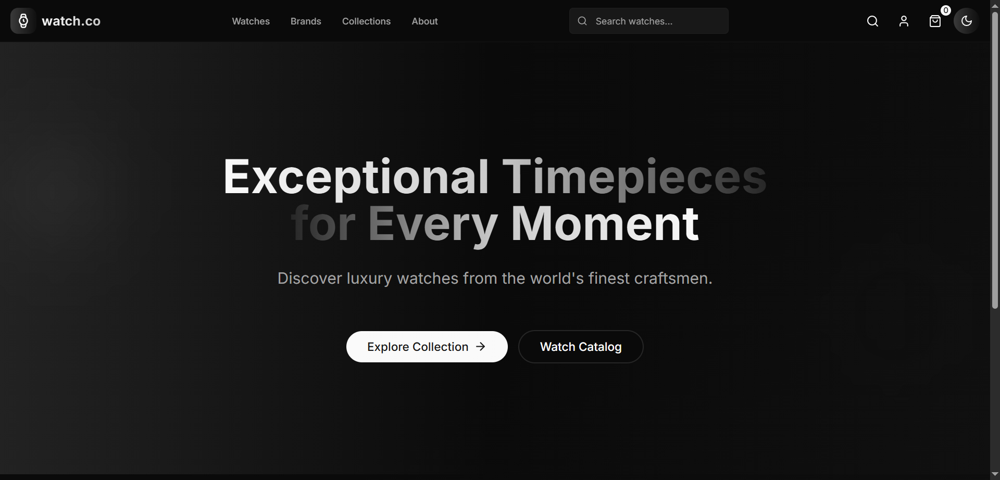

# watch.co

## Deployed Link

[watch.co](https://watch-co-henna.vercel.app/)

## Installation

### Steps to Install

1. Clone the repository:

   ```bash
   git clone https://github.com/iamatifmoin/watch.co.git
   cd watch.co
   ```

2. Install the dependencies:
   Using npm:
   ```bash
   npm install
   ```
   Or using Yarn:
   ```bash
   yarn install
   ```

### Running the Development Server

To run the application locally:

1. Run the development server:

   ```bash
   npm run dev
   ```

   Or with Yarn:

   ```bash
   yarn dev
   ```

2. Visit `http://localhost:3000` in your browser to access the application.

## Screenshots

Landing Page:



Products Page:


